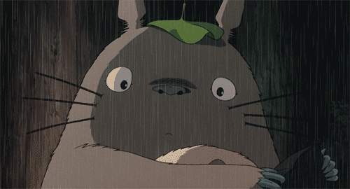

 <h1>Hi there, I'm Samiksha 🦦</h1>

<!--  -->
<!-- 
 -->

  
I’m a high school student with interests in data science 👩🏾‍💻, AI 🤖, chemistry 🧪, and effective design 💡, as well as passions for community outreach and volunteer work 🫂.

### Ask me about:
* my work as a research intern in Summer 2023 at Berkeley Lab as part of the Experiences in Research Program
* my experience with web development as a Girls Who Code SIP participant
* my newfound interest in artificial intelligence, sparked by AI4ALL @ UC Berkeley
* my experience as a logistics and social media officer for Hydra Hacks, a hackathon for marginalized gender identities in CS

 --- 
<!-- 

  <b>
<a href="https://linkedin.com/in/samikshalingan">LinkedIn</a>  ∙  <a href="https://devpost.com/slingan">Devpost</a></b>
 

 

  -->
 <!--  -->
  
 <!-- 

  

  

  
   
  

 -->
